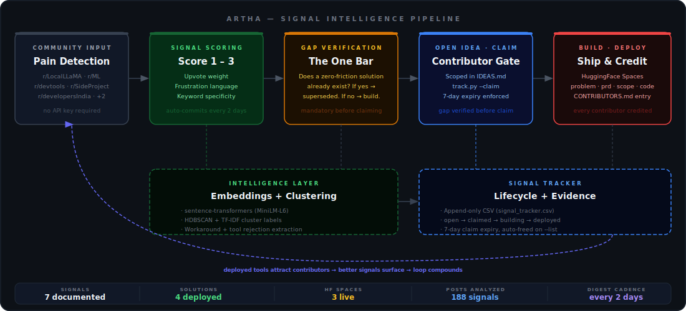

<div align="center">

# ARTHA

**Evidence-backed open-source build engine for AI/ML builders.**

*The system finds the problems. The community builds the tools.*
*The tools build credibility for everyone involved.*

---


</div>

---

> This is not a collection of ideas. It is a collection of evidence.

Every solution here traces back to a specific Reddit thread with real upvotes and real discussion. The signal is real. The gap is verified. The build is justified.

---

## How it works



---

## The one bar every solution must clear

> **Does a fully-solving, zero-friction version of this exist for AI/ML builders?**

Not "does something like this exist" — something always exists. The question is whether existing solutions require accounts, complex setup, or solve a slightly different problem. If yes — real gap. If no — we don't build it.

Two signals have been superseded on this basis. See [SIGNALS.md](SIGNALS.md).

---

## Solutions

| Solution | Signal | Builder | What it does | Live |
|---|---|---|---|---|
| [rag-eval-starter](solutions/rag-eval-starter/) | [SIGNAL-001](SIGNALS.md#-signal-001--rag-evaluation-expensive-models-underperform-cheaper-ones) | [@SidharthKriplani](https://github.com/SidharthKriplani) | Compare RAG configs across OpenAI, Anthropic, Gemini, Groq | [Try it →](https://huggingface.co/spaces/SidharthKriplani/rag-eval-starter) |
| [paper-repro-auditor](solutions/paper-repro-auditor/) | [SIGNAL-002](SIGNALS.md#-signal-002--ml-paper-reproduction-stuck-below-reported-accuracy) | [@SidharthKriplani](https://github.com/SidharthKriplani) | Paper config vs your config → ranked reproduction risk factors | [Try it →](https://huggingface.co/spaces/sidharthkriplani/paper-repro-auditor) |
| [finetune-failure-extractor](solutions/finetune-failure-extractor/) | [SIGNAL-005](SIGNALS.md#-signal-005--fine-tuning-feedback-loop-has-no-standard-tooling) | [@SidharthKriplani](https://github.com/SidharthKriplani) | Upload eval output → ranked failure modes + training priority list | [Try it →](https://huggingface.co/spaces/sidharthkriplani/finetune-failure-extractor) |
| [quant-pareto-bench](solutions/quant-pareto-bench/) | [SIGNAL-004](SIGNALS.md#-signal-004--quantization-accuracy-vs-latency-tradeoffs-are-invisible) | [@SidharthKriplani](https://github.com/SidharthKriplani) | GGUF files + prompts → accuracy vs latency Pareto frontier | CLI |

→ [Open ideas waiting to be claimed](IDEAS.md)

---

## Flagship trace: rag-eval-starter

<details>
<summary>See the full chain from community pain to deployed tool</summary>

| Step | What happened |
|---|---|
| **Pain** | r/LocalLLaMA: *"Evaluated a RAG chatbot and the most expensive model was the worst performer."* 22 upvotes, 27 comments. |
| **Signal** | Scored 3/3 — high engagement, clear frustration, specific workaround pattern detected |
| **Gap verification** | Existing tools require instrumentation, accounts, or solve a different problem. Zero-friction config comparison didn't exist. |
| **PRD** | [solutions/rag-eval-starter/prd.md](solutions/rag-eval-starter/prd.md) |
| **Eval plan** | [solutions/rag-eval-starter/eval_plan.md](solutions/rag-eval-starter/eval_plan.md) |
| **Live** | [HuggingFace Spaces →](https://huggingface.co/spaces/SidharthKriplani/rag-eval-starter) |

Every solution in `solutions/` follows this same chain.

</details>

---

## Contribute

### Build a solution for an open signal

```bash
# 1. Pick a signal from IDEAS.md
# 2. Claim it
python3 track.py --claim SIGNAL-XXX --github your-username

# 3. Build your solution in solutions/your-solution-name/
#    Required: README.md · problem.md · scope.md · requirements.txt

# 4. Open a PR → you appear in CONTRIBUTORS.md permanently
```

> **Claim expiry:** claims auto-free after 7 days if not moved to `building` or `deployed`.
> Keep your claim alive: `python3 track.py --update SIGNAL-XXX --status building`

### Propose a new signal

Have a pain point that isn't listed yet?

```
Open a GitHub Issue → [SIGNAL] Your pain in one sentence
     ↓
Include: community evidence (links + upvotes) + gap verification
     ↓
Maintainer reviews → labels signal-approved
     ↓
You add it to SIGNALS.md + IDEAS.md
     ↓
Claim it with track.py → build it
```

Signals without community evidence are not added. Read [CONTRIBUTING.md](CONTRIBUTING.md) for the full process.

---

## Repo map

<details>
<summary>Expand</summary>

```
artha/
├── SIGNALS.md               ← 7 documented pain points with evidence
├── IDEAS.md                 ← open, claimable contribution endpoints
├── CONTRIBUTING.md          ← how to build here
├── CONTRIBUTORS.md          ← everyone who shipped something
├── SPRINTS.md               ← sprint log — what was built and why
├── track.py                 ← signal lifecycle CLI (claim · build · deploy · expire)
├── run_intelligence.py      ← standalone intelligence pipeline runner
├── deploy_spaces.py         ← HuggingFace Spaces deployment script
├── digest/
│   └── scraper.py           ← Reddit scanner, auto-commits every 2 days (GH Actions)
├── intelligence/
│   ├── embeddings.py        ← sentence-transformers pipeline
│   ├── clustering.py        ← HDBSCAN + TF-IDF cluster labels
│   ├── scoring.py           ← quote ranking, workaround extraction
│   └── report.py            ← evidence pack generator
├── .github/
│   ├── workflows/digest.yml ← scheduled signal scan (every 2 days, 06:00 UTC)
│   └── ISSUE_TEMPLATE/      ← signal · idea · bug templates
├── storage/                 ← SQLite + SQLAlchemy, source-aware schema
├── api/main.py              ← FastAPI backend
├── ui/app.py                ← Streamlit evidence pack viewer
├── data/
│   ├── pain_signals.csv     ← live signal log, updates every 2 days
│   └── signal_tracker.csv   ← solution lifecycle tracker
└── solutions/
    ├── README.md            ← "which tool do I need?" decision guide
    ├── rag-eval-starter/
    ├── paper-repro-auditor/
    ├── finetune-failure-extractor/
    └── quant-pareto-bench/
```

</details>

---

## Run the intelligence pipeline

```bash
pip install -r requirements.txt
python3 run_intelligence.py
# Options: --top 5  --min-cluster 3  --save
```

**Communities tracked:**
`r/LocalLLaMA` · `r/MachineLearning` · `r/LanguageModelHacking` · `r/SideProject` · `r/devtools` · `r/developersIndia` · `r/indianstartups`

---

<div align="center">

*Built by [@SidharthKriplani](https://github.com/SidharthKriplani) · Contributions welcome — see [IDEAS.md](IDEAS.md)*

</div>
